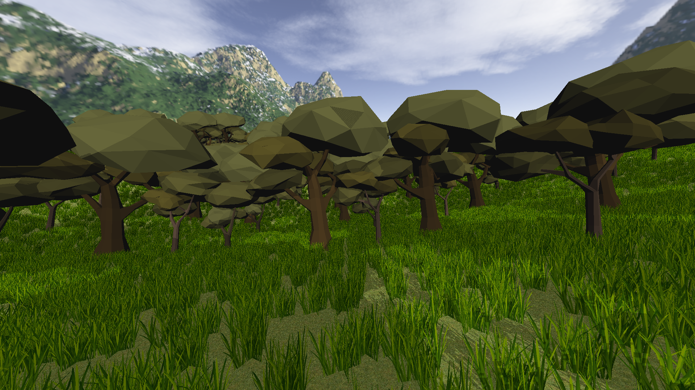
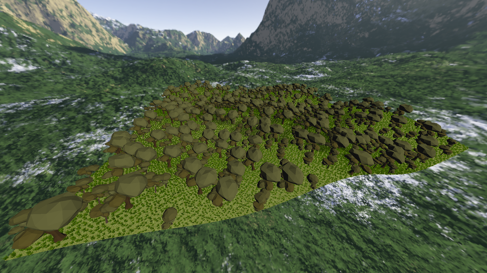

# model_viewer
When this repo was first conceived, it was originally intended to be nothing more than a program to allow one to view and manipulate 3D models in VR. Today, it is the seed of an engine that will allow me to prototype VR game ideas.

# Demo video
I recorded a demo video on 2-2-2020 that can be found [here](https://youtu.be/0_sz0D57apQ)

# Screenshots

